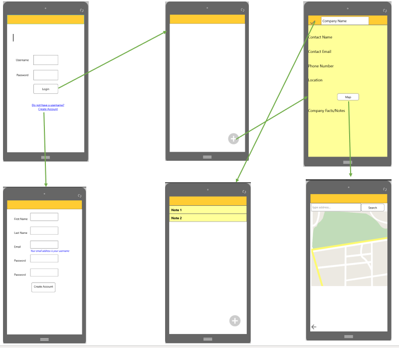
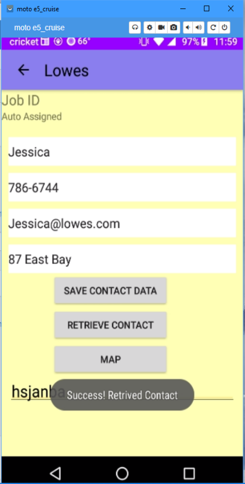

# Jennifer Tabor
## CS 499
### Southern New Hampshire University

- **Final Project Assessment**
- [x] Upload Self Assessment
- [Professional Self Assessment](https://github.com/hijackedUnicorn/hijackedUnicorn.github.io/blob/master/CS499_ProfessionalSelfAssement_JenniferTabor.docx)

- **Milestone One**
- [x] Upload Milestone One
- **Snippets of Code Review**
1. [Code Review_1](codeReview_1.jpg)
2. [Code Review_2](codeReview_2.jpg)
3. [Code Review_3](codeReview_3.jpg)
4. [Code Review_4](codeReview_4.jpg)
5. [Code Review_5](codeReview_5.jpg)
6. [Code Review_6](codeReview_6.jpg)
7. [Code Review_7](codeReview_7.jpg)
8. [Code Review_8](codeReview_8.jpg)
9. [Code Review_9](codeReview_9.jpg)
10. [Code Review_10](codeReview_10.jpg)
11. [Code Review_11](codeReview_11.jpg)
12. [Code Review_12](codeReview_12.jpg)
 
- **Milestone Two**
- [x] Upload Milestone Two
- [Milestone Two](https://github.com/hijackedUnicorn/hijackedUnicorn.github.io/blob/master/CS%20499_%20MilestoneTwo_Jennifer%20Tabor.docx)
- **Milestone Three**
- [x] Upload Milestone Three
- [Milestone Three](https://github.com/hijackedUnicorn/hijackedUnicorn.github.io/blob/master/CS%20499_Milestone%20Three_Jennifer%20Tabor.docx)
- **Milestone Four**
- [x] Upload Milestone Four
- [Milestone Four](https://github.com/hijackedUnicorn/hijackedUnicorn.github.io/blob/master/CS%20499_Milestone%20Four_Jennifer%20Tabor.docx)

## Project
- [Project](https://github.com/hijackedUnicorn/hijackedUnicorn.github.io/blob/master/PortfolioNotes_MilestoneFour_JenniferTabor.zip)

<html>
	<head>
		<title>Jennifer Tabor's ePortfolio</title>
		<!-- link to main stylesheet -->
		<link rel="stylesheet" type="text/css" href="/css/main.css">
		 
		
	</head>

	<body>
	

	
	

	

	
	

	</body>
	
	<body>
	<footer>
    		<ul>
        		<li><a href="mailto:jen.leonard77@outlook.com">email</a></li>
        		<li><a href="https:github.com/hijackedUnicorn">github.com/hijackedUnicorn</a></li>
			</ul>
		</footer>
		
	</body>
</html>

